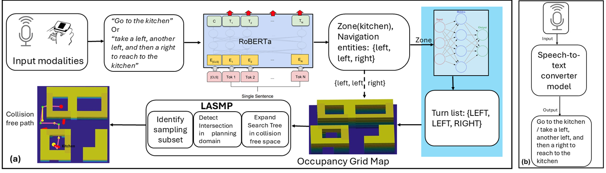

# LASMP: Language Aided Subset Sampling Based Motion Planner 
(Paper under review CASE 2025)

## LASMP highlights
### The workflow diagram of LASMP

There are two key modules in LASMP
- Custom NER model
- Sample efficient path planner

## Custom NER Model
One of the key aspects of this work is how efficiently we can provide instructions to the robot so that it can perform the navigation task effectively.The instruction can be provided in two modalities: text messages or voice commands. When the instruction is in the form of a text message, no additional processing is required. The text is directly input into the Named Entity Recognition (NER) pipeline for entity extraction, which is a subtask of NLP (Natural Language Processing). In contrast, if the instruction is provided as a voice command, an additional step is needed before it can be processed by the NER pipeline. In this case, the voice command is transcribed into text using the transformer-based model Whisper (as shown in section B of the figure above), which performs Automatic Speech Recognition (ASR) to convert the spoken input into text. 

We used NER model to extract navigational entities, such as left, right, etc., and zone entities, such as bedroom, kitchen. The zone entities are associated with various indoor locations within a building. We employed a transformer-based language model, RoBERTa, for the custom NER task. The output of the NER task is either a combination of a turn-list and destination, or it could be just the destination. For the former, the coordinates of the identified destination are retrieved from a predefined lookup table. If only the destination is outputted by the NER model, the associated turns are obtained through a pre-trained feedforward network (the blue-shaded sub-module in the figure above). This network maps the concatenated vector, consisting of the robot's current position coordinates and the destination coordinates, to a class associated with a specific turn list.

We trained our NER pipeline using different language models with the help of the spaCy framework and conducted a comparative study between the models. After analyzing the performance metrics of each model, we found that RoBERTa performed the best on our custom dataset. Therefore, we chose RoBERTa for the LASMP framework.

### Dataset Preparation:

A few instances from the assembled dataset utilized for training the language model: the second column shows the input texts while the custom labels are located in the third column. The labels in this case are a tuple with three elements, the start and end indices of the target entities and the third element is the entity’s name.

| Example Texts                                   | Annotation                |
| ----------------------------------------------  | ------------------------- |  
|You can go right first and then take left turn.  | 8,16,"RIGHT",32,46,"LEFT" |
|Move forward to the music room                   | 20, 30, "ZONE"            | 

## Sample efficient path planner
details about the planner.

## Simulation Results

## Experimental Results
